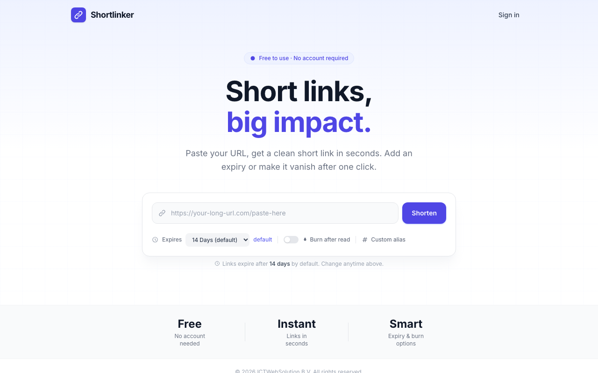
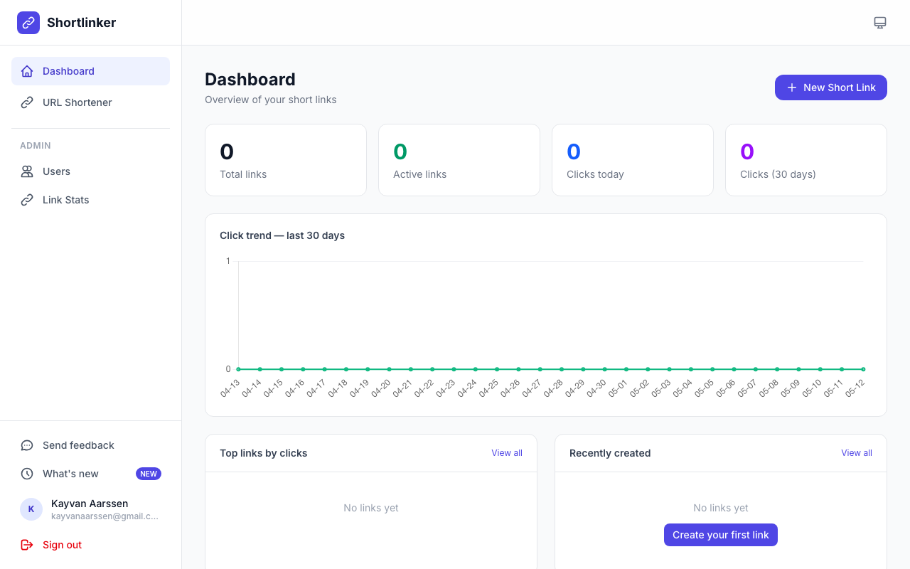
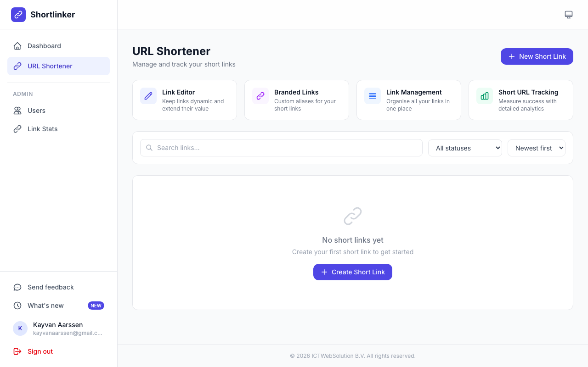
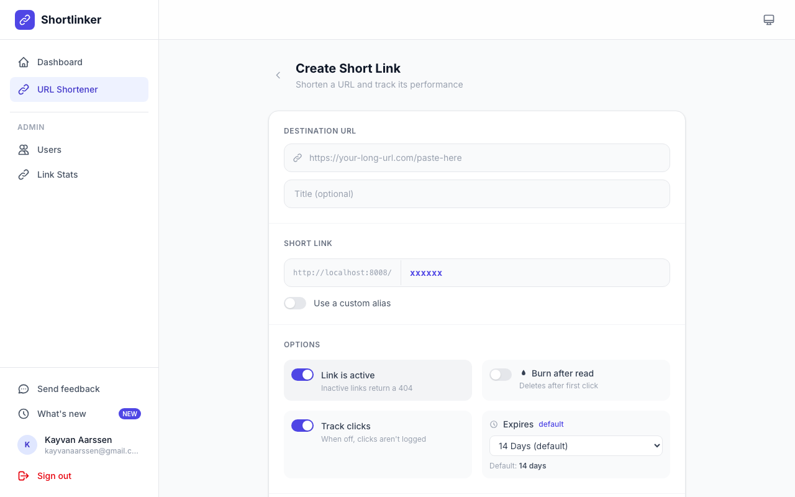
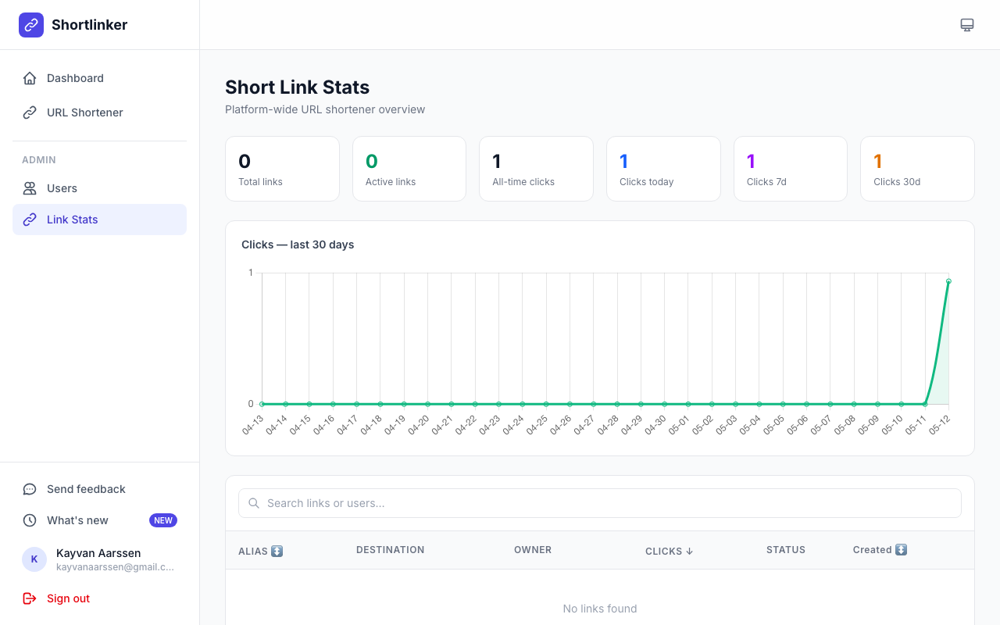
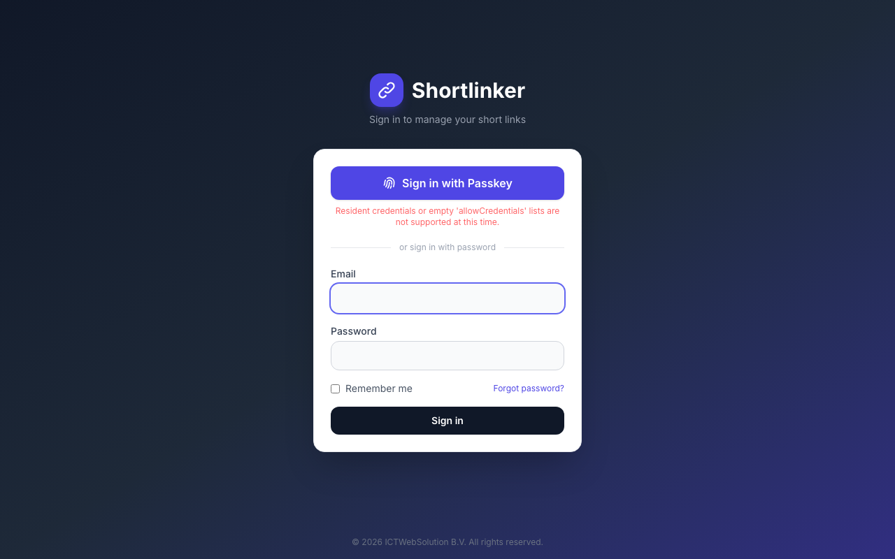
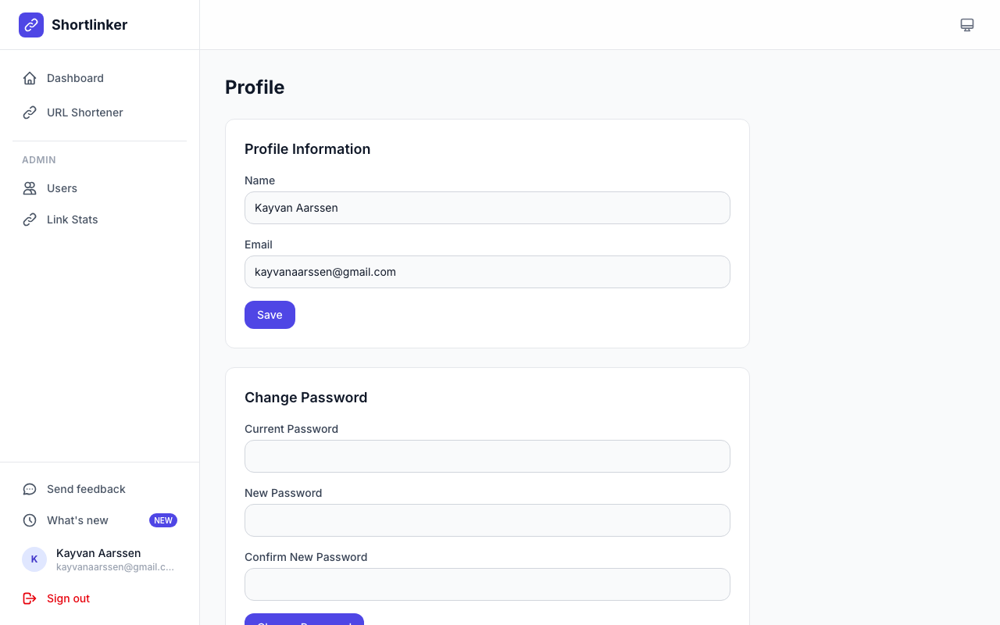

# Shortlinker

[](CHANGELOG.md)
[](https://laravel.com)
[](https://vuejs.org)
[](https://tailwindcss.com)
[](https://opensource.org/licenses/MIT)

A self-hosted URL shortener built with Laravel and Vue.js. Shorten URLs instantly without an account, track clicks with geolocation analytics, set expiry dates, burn-after-read links, and manage everything from a clean dashboard.

> **Disclaimer:** This software is provided "as is", without warranty of any kind. Use at your own risk. The authors are not responsible for any data loss, security breaches, or other damages resulting from the use of this software. Always review the code and configure proper security measures before deploying to production.

## Screenshots

### Public homepage

<p align="center">
  
</p>

### Dashboard & link management

<p align="center">
  
  &nbsp;
  
</p>

### Create link & administration

<p align="center">
  
  &nbsp;
  
</p>

### Login & profile

<p align="center">
  
  &nbsp;
  
</p>

## Features

### URL shortening
- **No account required** — Anyone can shorten a URL from the public homepage.
- **Custom aliases** — Choose your own alias (min. 5 characters, alphanumeric, hyphens, underscores).
- **Unambiguous character set** — Auto-generated aliases exclude confusing characters (`0`, `O`, `1`, `I`, `l`, `L`, `o`, `f`).
- **Expiry presets** — Choose from Never, 1 Hour, 2 Hours, 4 Hours, 6 Hours, 12 Hours, 1 Day, 2 Days, 3 Days, 5 Days, 7 Days, 14 Days, or 30 Days. Default is **14 days**.
- **Custom expiry** — Pick an exact date and time for link expiration.
- **Burn after read** — Link self-destructs after the first click; no click record is stored.
- **QR code generation** — Download a high-res PNG QR code for any short link.
- **Auto-copy** — Short URL is copied to clipboard immediately on creation.

### Click analytics
- **Per-link analytics dashboard** — Daily and hourly charts, totals, browser, device, OS, country, and referrer breakdowns.
- **Geolocation** — IP-based country and city lookup via ip-api.com (cached 24h).
- **No-tracking option** — Disable click logging per link; clicks are not counted or stored.
- **Global platform stats** — Super admins see network-wide totals, 30-day trend, and a sortable links table with owner info.

### Link management (authenticated)
- **Dashboard** — Stat cards (total links, active links, clicks today, clicks last 30 days), 30-day trend chart, top 5 links, and recently created links.
- **Full CRUD** — Create, edit, delete, and bulk-delete short links.
- **Search & filter** — Filter by status (active / inactive / expired), sort by newest, oldest, or most clicks.
- **Status badges** — Active, Inactive, and Expired states shown inline.
- **Link activation toggle** — Disable a link without deleting it (returns 404).

### Accounts & authentication
- **Invite-only access** — No public registration. Admins invite users via secure single-use links.
- **Mandatory two-factor authentication** — TOTP authenticator apps, email OTP, and WebAuthn passkeys (Face ID / Touch ID / Windows Hello).
- **Password reset** — Email-based reset plus admin-initiated reset links.
- **Admin-initiated 2FA reset** — Force a user to re-enroll on next sign-in.

### User roles
- **Three-tier role model** — `user`, `admin`, `super_admin`.
- **Admins** — Manage users, send invites, reset passwords and 2FA.
- **Super admins** — All admin capabilities plus platform-wide Link Stats dashboard.
- **Artisan promotion** — `php artisan user:promote <email> <user|admin|super_admin>`.

### Profile & preferences
- **Theme** — Light, dark, or auto (follows system).
- **Timezone & date format** — Configurable per user.
- **Passkey management** — Register and revoke passkeys from the profile page.

### UI / UX
- **Light & dark mode** — Full coverage across every page.
- **Responsive** — Sidebar on desktop, bottom tab bar on mobile.
- **Flash toasts** — Non-blocking success/error notifications.
- **Styled invite email** — Matches app branding.

## Tech Stack

| Layer | Technology |
|---|---|
| Backend | Laravel 13, PHP 8.3+ |
| Frontend | Vue 3, Inertia.js v3, Tailwind CSS 4 |
| Charts | Chart.js + vue-chartjs |
| QR codes | endroid/qr-code v6 |
| Authentication | spatie/laravel-passkeys (WebAuthn), TOTP, email OTP |
| Database | MySQL / PostgreSQL / SQLite |

## Installation

### Requirements

- PHP 8.3+
- Composer
- Node.js 18+
- MySQL 8.0+ / PostgreSQL 14+ / SQLite

### Local development

```bash
# Clone the repository
git clone https://github.com/ICTWebSolutionBV/shortlinker.git
cd shortlinker

# Install dependencies
composer install
npm install

# Environment setup
cp .env.example .env
php artisan key:generate

# Database (SQLite by default)
touch database/database.sqlite
php artisan migrate

# Build & serve
npm run build
php artisan serve
npm run dev
```

Create your first user and promote to super_admin:

```bash
php artisan tinker
# >>> \App\Models\User::create(['name'=>'Your Name','email'=>'you@example.com','password'=>bcrypt('yourpassword'),'role'=>'super_admin']);
```

Or promote an existing user:

```bash
php artisan user:promote you@example.com super_admin
```

## Deploying with Ploi

### 1. Create a new site

- In Ploi, create a new site pointing to your domain.
- Set the web directory to `/public`.
- Select PHP 8.3+ as the PHP version.

### 2. Connect repository

- Go to your site's **Repository** tab.
- Connect to `github.com/ICTWebSolutionBV/shortlinker`.
- Set branch to `main`.

### 3. Deploy script

```bash
cd {SITE_DIRECTORY}
git pull origin main

composer install --no-interaction --prefer-dist --optimize-autoloader --no-dev

npm ci
npm run build

php artisan migrate --force
php artisan config:cache
php artisan route:cache
php artisan view:cache
php artisan storage:link

echo "Shortlinker deployed successfully."
```

### 4. Environment variables

```env
APP_NAME="Shortlinker"
APP_ENV=production
APP_DEBUG=false
APP_URL=https://your-domain.com

DB_CONNECTION=mysql
DB_HOST=127.0.0.1
DB_PORT=3306
DB_DATABASE=shortlinker
DB_USERNAME=your_db_user
DB_PASSWORD=your_db_password

MAIL_MAILER=smtp
MAIL_HOST=your-smtp-host
MAIL_PORT=587
MAIL_USERNAME=your-smtp-user
MAIL_PASSWORD=your-smtp-password
MAIL_FROM_ADDRESS=noreply@your-domain.com
MAIL_FROM_NAME="Shortlinker"

# Set false locally to skip 2FA enforcement
# TWO_FACTOR_ENABLED=true
```

### 5. First admin user

SSH into your server or use Ploi's **Terminal**:

```bash
cd {SITE_DIRECTORY}
php artisan user:promote you@example.com super_admin
```

### 6. SSL

Enable **Let's Encrypt** SSL in Ploi's **SSL** tab.

## Environment variables

| Variable | Default | Description |
|---|---|---|
| `APP_NAME` | `Shortlinker` | App name shown in emails and browser tabs |
| `APP_URL` | `http://localhost` | Base URL — used for generating short links |
| `APP_DEBUG` | `false` | Show detailed errors. Must be `false` in production |
| `TWO_FACTOR_ENABLED` | `true` | Master switch for mandatory 2FA. Set `false` locally |
| `DB_CONNECTION` | `sqlite` | Database driver: `sqlite`, `mysql`, `pgsql` |
| `MAIL_MAILER` | `log` | Mail transport (`log` writes to Laravel log locally) |
| `MAIL_FROM_ADDRESS` | `hello@example.com` | Sender address for invite and reset emails |
| `FEEDBACK_EMAIL` | `MAIL_FROM_ADDRESS` | Where in-app feedback submissions are sent |
| `CACHE_STORE` | `database` | Cache driver |
| `QUEUE_CONNECTION` | `database` | Queue driver (`sync` for small instances) |
| `SESSION_DRIVER` | `database` | Session storage |
| `SESSION_LIFETIME` | `120` | Idle session timeout in minutes |

> After changing any `.env` value, run `php artisan config:clear` (and `php artisan config:cache` in production).

## License

This project is licensed under the MIT License.

**USE AT YOUR OWN RISK.** The authors assume no liability for any damages or issues arising from the use of this software.
